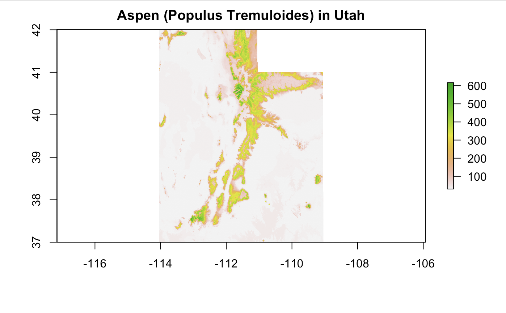
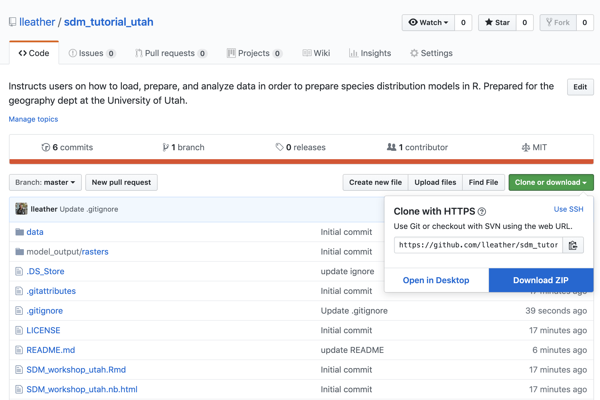

## Welcome! 

This workshop will show you how to load, manipulate, visualize, and analyze spatial data in R. Our end application will be species distribution models, but you can use similar techniques for other kinds of spatial analysis and modeling.  

Our example today will be species distribution models for aspen (Populus tremuloides) in Utah. See [Elith et al. 2009](https://www.annualreviews.org/doi/abs/10.1146/annurev.ecolsys.110308.120159) for a broader overview on species distribution modeling. 

### A few notes: 

- This workshop was developed in R Markdown. 
As a user of this workshop, this means that if you are working from a PDF version of this report, you are seeing the same content that is in the script. 
As a future user of R Markdown, this means that you can write code, make figures, and annotate your findings all within one document-- that you can then export for multiple uses. Please take the opportunity to explore both the PDF and .Rmd versions of this workshop! 

- This workshop uses the [here](https://github.com/jennybc/here_here) package to create dynamic references to file paths. This means you never have to use setwd() again! By creating an R project in a folder of your choice, here() identifies the source or home directory for the project on your machine, so that you don't have to manually set the location of the files or scripts. 

- If you download or clone the entire github repository, you will have all the data you need to run this model. The repository also already includes prepared data, but this workflow takes you through all the steps you would use to load, prep, and use the data on your own. 

## Learning Objectives 

Over the course of this workshop, you will learn how to: 

- read and write point data
- read and write polygon data
- read and write raster data
- combine different types of spatial data
- crop and mask spatial data
- set and change the projection of a dataset
- manipulate data using dplyr
- create simple visualizations using base R and ggplot2

Additionally, we will learn some foundational concepts behind species distribution modeling.

The file "SDM_workshop_utah.Rmd" will walk you through how to manipulate spatial data and create species distribution models in R. 

The file "SDM_workshop_mappingSupplement.Rmd" provides additional methods to plot spatial data in R.

If you are not familiar with how to clone a repository, you can get started by downloading the repository as a zip file.

